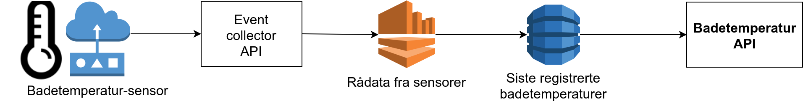
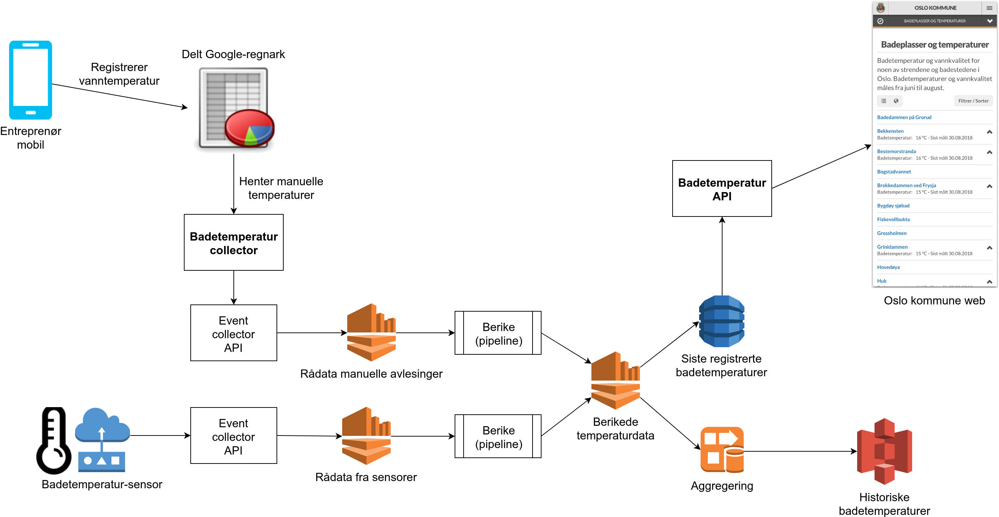

Design for badetemperatur-tjeneste
==================================

## Dagens prototype

Det er satt opp en prototype av badetemperatur-tjeneste i
dataplattformen. Badetemperatur-sensorene sender data til
`Event Collector` som skriver til en Kinesis-strøm. Derfra blir
temperatur-dataene skrevet ned i en DynamoDB-tabell.
Badetemperatur-APIet leser fra DynamoDB og leverer sensor-dataene
direkte:

</img>

Eksempel på data fra prototype:

```json
[
  {
    "name": "xnb003564354000000000b",
    "location": "Oslo badetemp # 1",
    "value": 4.3046500664597716,
    "measureTime": "2019-03-25T00:33:42.000+0000",
    "unit": "C"
  }
]
```

## Krav til ny løsning

Ny løsning må kunne levere badetemperaturer til både Oslo kommune sine
websider og til Yr.no. Yr.no skal ha temperaturer målt før kl 08.00.

Løsningen må kunne levere data både fra sensorer og fra manuelt
innrapporterte avlesninger. De manuelle dataene ligger i et
Google-regnark.


## Eksempler på temperatur- og værdata

[Eksempler på andre APIer med temperatur- og værdata](API_eksempler.md).

## Løsningsforslag

Vi foreslår å lage en egen mikrotjeneste `Badetemperatur Collector`
(AWS Lambda?) som periodisk henter de manuelt registrerte temperaturene
fra Google-regnarket og leverer de til `Event Collector`. Både denne
datastrømmen og de eksisterende sensordataene må berikes/transformeres
for å gi et felles format på badetemperatur-dataene. Disse samles så i
en felles eventstrøm.

Denne felles eventstrømmen vil sendes til DynamoDB som oppbevarer siste
avleste badetemperatur. I tillegg kan den sendes til S3 via f.eks.
Kinesis Firehose for å aggregere opp historiske badetemperaturer.

</img>

Forslag til nytt format på badetemperatur-dataene:

```json
{
  "temperatures": [
    {
      "location": {
        "id": "8171",
        "name": "Hovedøya",
        "latitude": 59.893905,
        "longitude": 10.726743
      },
      "name": "Hovedøya brygge",
      "measureTime": "2019-03-25T02:33:42+0200",
      "waterTemperature": {
        "value": 4.3,
        "unit": "C"
      },
      "airTemperature": {
        "value": -1.2,
        "unit": "C"
      }
    }
  ]
}
```